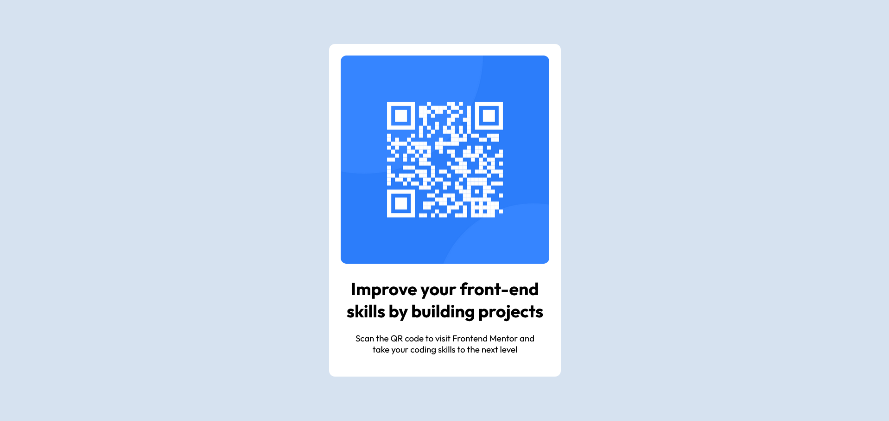

# Frontend Mentor - QR code component solution

This is a solution to the [QR code component challenge on Frontend Mentor](https://www.frontendmentor.io/challenges/qr-code-component-iux_sIO_H). Frontend Mentor challenges help you improve your coding skills by building realistic projects.

## Table of contents

- [Overview](#overview)
  - [Screenshot](#screenshot)
  - [Links](#links)
- [My process](#my-process)
  - [Built with](#built-with)
  - [What I learned](#what-i-learned)
  - [Continued development](#continued-development)
  - [Useful resources](#useful-resources)
- [Author](#author)
- [Acknowledgments](#acknowledgments)

**Note: Delete this note and update the table of contents based on what sections you keep.**

## Overview
This is a challenge from frontendmentor to build a QR Code component. The challenge is for newbie level. To complete this challenge i only need to use HTML and CSS.

### Screenshot

### Links

- Solution URL: [QR Code Component Solution](https://github.com/Odiesta/qr-code-component)
- Live Site URL: [QR Code Component](https://odiesta.github.io/qr-code-component/)

## My process
I look at the design for desktop first and determine the html structure needed. Then i write html tag along with css, images. Then i start writing CSS for the desktop version. After it done i worked on mobile version for responsiveness.

### Built with

- HTML
- CSS

### What I learned

I struggle to center the container. I try setting the margin `0 auto` but it didn't work. the container is centered only horizontally. Then i try setting margin top it shows up weird when resize screen. Then i look at youtube and find the person using `display: flex` and `align-items: center`. Then i tried it and it worked.

The next thing is how to make the font size look similar to mobile design that they provided. I try to change the font size of the body but it didn't work. Then i look at chrome developer tools and found that the `h1` use `2em` meaning 2 times the size of body font. Then i try changing it to `1.5em` and it worked.

### Continued development

I focus on practicing my HTML and CSS skill until i able to write it comfortably and confidently before moving to JS and backend.

### Useful resources

- [Stats Preview Card Component](https://www.youtube.com/watch?v=dhBR6-Jjql4&list=PLcZZlEf3w738Bv45a8yI_iIv2OGx_JLvz&index=2&t=833s) - This helped me to center the container.
- [align-items](https://css-tricks.com/almanac/properties/a/align-items/#:~:text=The%20align%2Ditems%20property%20defines,that%2C%20on%20the%20vertical%20axis.) - This helped me to understand more about align items on display flex

## Author

- Website - [Odiesta Shandikarona](https://github.com/Odiesta)
- Frontend Mentor - [@Odiesta](https://www.frontendmentor.io/profile/Odiesta)
- Twitter - [@OdiestaS](https://www.twitter.com/OdiestaS)

## Acknowledgments

Thanks to [Mr Coder](https://www.youtube.com/c/MrCoderYt) video that shows some example of how to do the frontendmentor challenge and also thanks to [Frontendmentor](https://www.frontendmentor.io/) for creating this challenge
